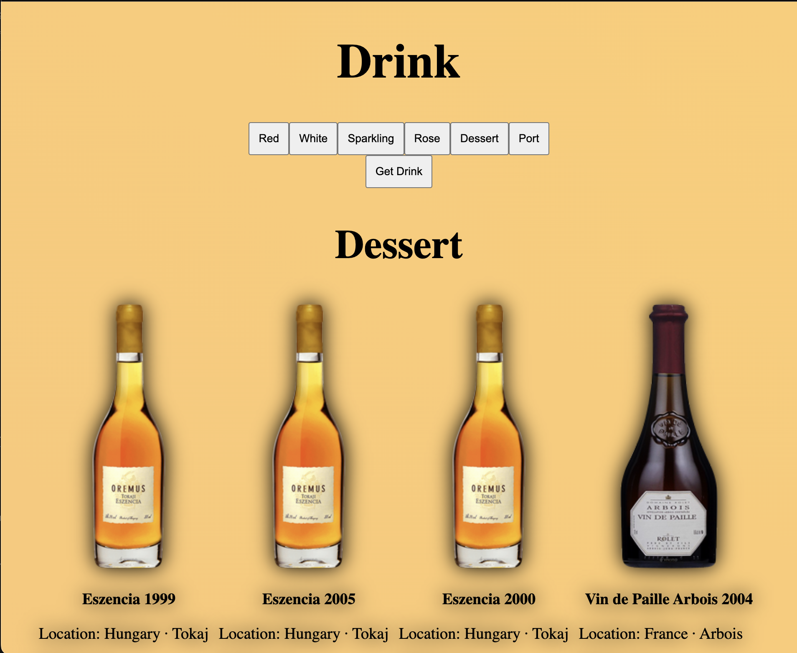

# Wine Cellar React

I created a React app where I learned about using useState, map, and Fetch. As part of the project, I utilized the React Sample API for data retrieval.

## Website 
[click on this link](https://www.bp.com/)

 

## Features
* useState
* Fetch
* map()

